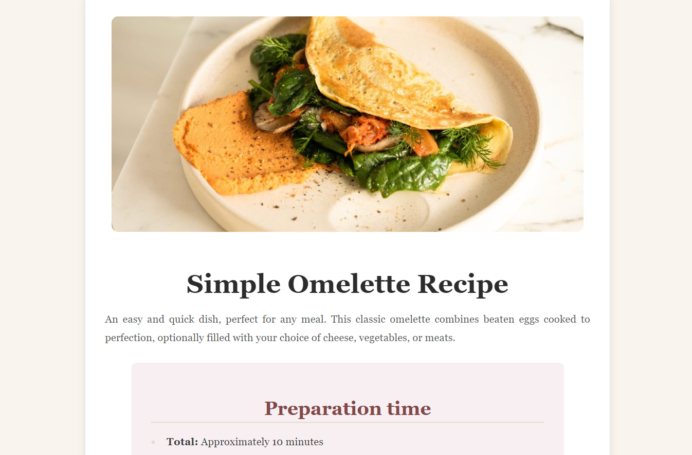
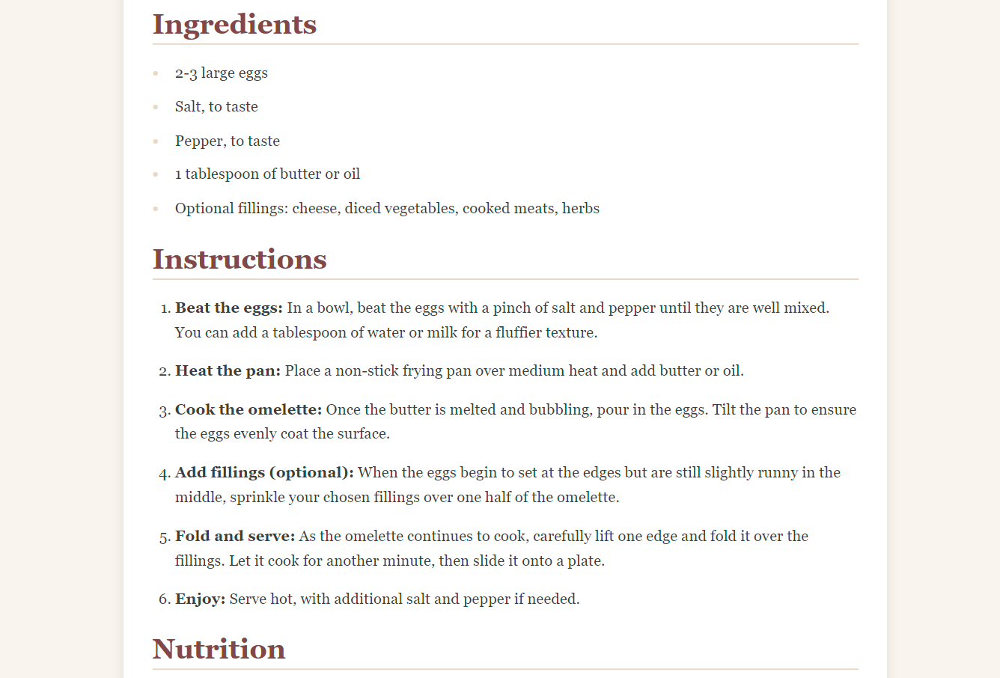
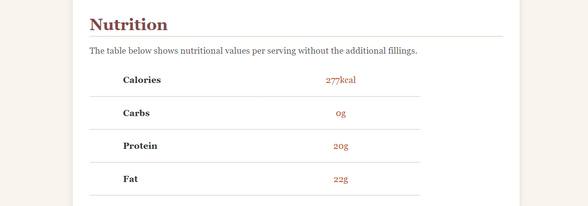

# 🍳 Simple Omelette Recipe Page

A clean and responsive web page designed for displaying a **Simple Omelette Recipe** using **HTML** and **CSS**.

---

## 🌟 Features

- **Responsive Design**: Adapts seamlessly to various screen sizes.
- **Section Highlights**:
  - 📅 Preparation Time
  - 🥚 Ingredients
  - 📋 Step-by-Step Instructions
  - 🔢 Nutritional Facts
- **Clean Aesthetics**:
  - Soft colors and rounded corners for a modern look.
  - Proper padding and spacing for better readability.

---

## 📸 Design Preview

 



---

## 🛠️ Built With

- **HTML5** for the structure.
- **CSS3** for styling and responsiveness.

---

## 📂 Folder Structure

```plaintext
📦 simple-omelette-recipe
├── 📄 index.html          # Main HTML file
├── 📄 styles.css          # CSS file for styling
├── 📂 assets              # Folder for assets like images
│   └── desktop-design.jpg # Preview image
└── 📄 README.md           # Documentation file
